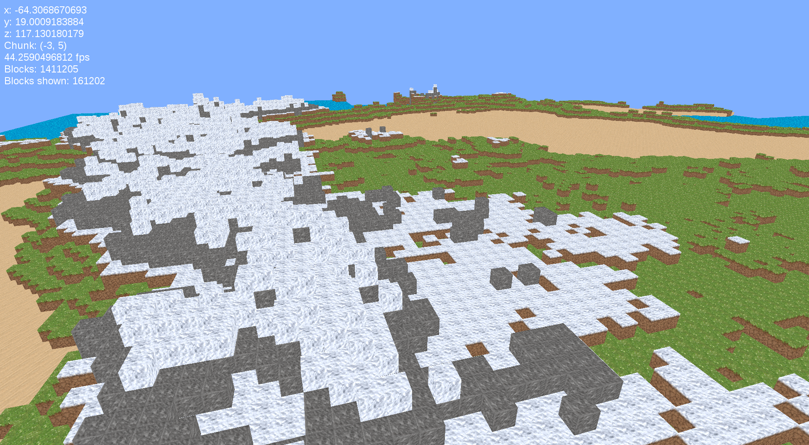

A program to procedurally generate 3-dimensional worlds made of cubes based on a number of terrain algorithms. 

### To run:
* Generate terrain files by running generate_world.py; change the SEED variable to change the output of the terrain algorithm if desired.
* Load the program by running main.py. Make sure the WORLD_FILE variable is equal to the name of the region file.

#### Dependencies:
* Pyglet
* Numpy
* PyPlatec

`pip install pyglet numpy pyplatec`

#### Controls:
__WASD:__ Normal movement
__Space:__ Fly up
__Shift:__ Fly down
__Esc:__ Pause